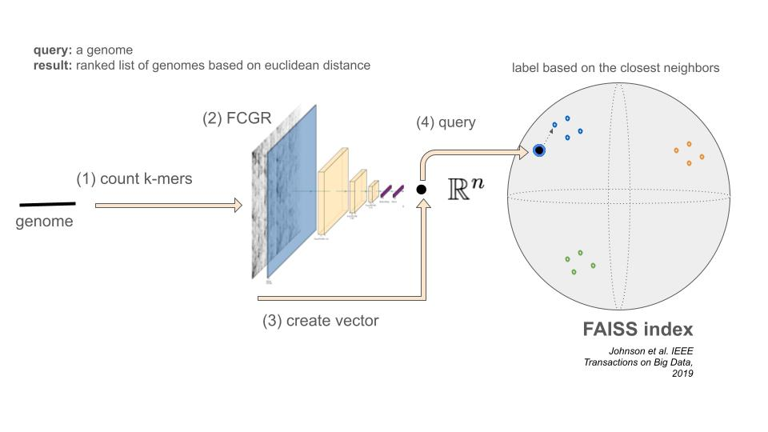

# Panspace
Taxonomy-aware embeddings for rapid querying of prokaryotes pangenomes



`panspace` is a library based on tensorflow and faiss index.
It provides commands for creating FCGR from kmer counts, train an autoencoder,
extract Encoder and Decoder from a trained model, and create and query an Index
of embeddings.
 
## Install the package
`panspace` requires  python >= 3.9, < 3.11.

with **CPU** support

```bash
pip install "panspace[cpu] @ git+https://github.com/pg-space/panspace.git"
```

with **GPU** support

```bash
pip install "panspace[gpu] @ git+https://github.com/pg-space/panspace.git"
```

Alternatively, first clone the repository

```bash
git clone git@github.com:pg-space/panspace.git
cd panspace
``` 

with **CPU** support
```bash
pip install .[cpu]
```

or with **GPU** support 
```bash
pip install .[gpu]
```

### Install from conda environment
with **CPU** support
```bash
conda env create -f envs/cpu.yml
conda activate panspace-cpu
```

with **GPU** support
```bash
conda env create -f envs/gpu.yml
conda activate panspace-gpu
```

## CLI

```bash
panspace --help 

Usage: panspace [OPTIONS] COMMAND [ARGS]...                                                                               
                                                                                                                           
 🐱 Welcome to panspace, a tool for Indexing and Querying a pan-genome in an embedding space                               
                                                                                                                           
╭─ Options ───────────────────────────────────────────────────────────────────────────────────────────────────────────────╮
│ --install-completion          Install completion for the current shell.                                                 │
│ --show-completion             Show completion for the current shell, to copy it or customize the installation.          │
│ --help                        Show this message and exit.                                                               │
╰─────────────────────────────────────────────────────────────────────────────────────────────────────────────────────────╯
╭─ Commands ──────────────────────────────────────────────────────────────────────────────────────────────────────────────╮
│ data-curation    Find outliers and mislabaled samples.                                                                  │
│ docs             Open documentation webpage.                                                                            │
│ fcgr             Create FCGRs from fasta file or from txt file with kmers and counts.                                   │
│ index            Create and query index. Utilities to test index.                                                       │
│ stats-assembly   N50, number of contigs, avg length, total length.                                                      │
│ trainer          Train Autoencoder/Metric Learning. Utilities.                                                          │
│ utils            Extract info from text or log files                                                                    │
│ what-to-do       🐱 If you are new here, check this step-by-step guide                                                  │
╰─────────────────────────────────────────────────────────────────────────────────────────────────────────────────────────╯
```

## Download `index`


## Query `index`


## Create your own `index`


## Query bacterial

___
# Author
`panspace` is developed by [Jorge Avila Cartes](https://github.com/jorgeavilacartes/)