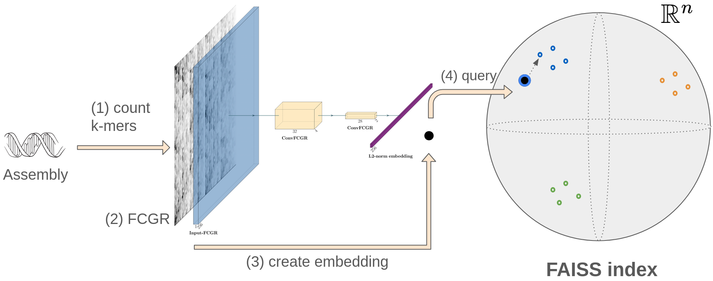

<div align="center">
<!-- <div> -->
    
</div>

# `panspace` 

**Related Article** [PanSpace: Fast and Scalable Indexing for Massive Bacterial Databases](https://doi.org/10.1101/2025.03.19.644115)

`panspace` is a library for creating and querying vector based indexes for bacterial genome (draft) assemblies.

`panspace` pipeline for querying works as follows,
1. First, each genome is represented by its Frequency matrix of the Chaos Game Representation of DNA (FCGR)
2. Then, the FCGR is mapped to a n-dimensional vector, the _embedding_, using a Convolutional Neural Network called `CNNFCGR`, the _Encoder_,
3. Finally, the _embedding_ --the compressed representation of the input genome-- is used to query an index of these vectors representing a bacterial pangenome. 

<div align="center">
    
</div>

The library is based on tensorflow and faiss index.


[Download the index and encoder](https://zenodo.org/records/17402877)

## Available indexes

Inside each file you will find
- Encoder: `checkpoints/<name-model>.keras`
- Index: `index/panspace.index`, and in the same folder some json files with metadata (labels)

| Encoder | Kmer | Embedding Size | file                                        |
|---------|------|----------------|---------------------------------------------|
| CNNFCGR | 8    | 256            | `triplet_semihard_loss-ranger-0.5-hq-256-CNNFCGR_Levels-level1-clip80.zip` **(Best)** |
| CNNFCGR | 6,7,8| 128,256,512    | check others... |

We provide a **snakemake** pipeline to query a collection of genomes (from a folder), if the environment was installed with conda
from the `.yml` file, then `snakemake` was installed. 

After decompressing the `.zip` you will find two folders: `checkpoints` and `index`. You need the path to the `.keras`file and to `panspace.index`

## Try `panspace` queries for single files

Clone the repository 
```bash
git clone https://github.com/pg-space/panspace.git
cd panspace
```

and install the library
with **CPU** support
```bash
conda env create -f envs/cpu.yml
conda activate panspace-cpu
```

or with **GPU** support
```bash
conda env create -f envs/gpu.yml
conda activate panspace-gpu
```

Then run the streamlit app
```bash
panspace app
```

## Query `index` from a folder of files
___

We can query the index with 
```bash
panspace query-smk \
    --dir-sequences "<path/to/folder>" \
    --path-encoder "<path/to/checkopoints/weights.keras>" \
    --path-index "<path/to/panspace.index>"
```
__Note__ this is just a parser to a snakemake pipeline.

for more, check 
```bash
panspace query-smk --help
```

<!-- 
Or directly using an environment with snakemake (the only requirement, the pipelines will install `panspace` on the run)

1. [install snakemake](https://snakemake.readthedocs.io/en/stable/getting_started/installation.html),
```bash
conda create -c conda-forge -c bioconda -n snakemake snakemake
conda activate snakemake
conda config --set channel_priority strict -->
<!-- ``` -->

### Using snakemake directly, we first need to 

1. set parameters in `scripts/config_query.yml`, 

    - **directory with sequences** (accepted extensions `.fa.gz`, `.fa`, `.fna`) 
    - define an **output directory** to save query results
    - **gpu** or **cpu** usage
    - path to the **encoder** (`<path/to/encoder>.keras`)
    - path to the **index**  (`<path/to/panspace-index>.index`)

2. and run
```bash
snakemake -s scripts/query.smk --cores 8 --use-conda
```

**Optional: for faster queries**
recommended if you have hundreds or thousands of assemblies to query 

First install the [FCGR extension to KMC3](https://github.com/pg-space/fcgr/)
and put the path to the installed bin of the `fcgr` tool in the `scripts/config_fcgr.yml` file. Then run, 
 
```bash
snakemake -s scripts/query_fast.smk --cores 8 --use-conda
```

or put it directly on bash
```bash
snakemake -s scripts/query_fast.smk --cores 8 --use-conda --config fcgr_bin=<path/to/fcgr>
```

_NOTES_ 
- change the number of cores (`--cores <NUM_CORES>`) if you have more availables, this will allow the parallelization of k-mer counts from assemblies done by [KMC3](https://github.com/refresh-bio/KMC) (by default `kmc_threads: 2`, see `scripts/config.yml`).
- This extension constructs FCGR representations with a C++ extending KMC3 output. The default version parses the output of KMC as a dictionary of k-mer counts and then uses the python library [ComplexCGR](https://github.com/AlgoLab/complexCGR) for the construction of the FCGR. 

## Create your own `encoder` and `index`
___
 
### Install the package

`panspace` requires  python >= 3.9, < 3.11.

with **CPU** support


```bash
pip install "panspace[cpu] @ git+https://github.com/pg-space/panspace.git"
```

with **GPU** support

```bash
pip install "panspace[gpu] @ git+https://github.com/pg-space/panspace.git"
```

### Install from conda environment

with **CPU** support
```bash
conda env create -f envs/cpu.yml
conda activate panspace-cpu
```

with **GPU** support
```bash
conda env create -f envs/gpu.yml
conda activate panspace-gpu
```

## step-by-step guide


### CLI

It provides commands for
- creating FCGR from kmer counts,
- train an encoder using metric learning (if labels are available) or an autoencoder,
- create and query an Index of _embeddings_.

```bash
panspace --help                                                                (panspace-cpu) 
                                                                                                         
 Usage: panspace [OPTIONS] COMMAND [ARGS]...                                                             
                                                                                                         
 🐱 Welcome to panspace (version 0.1.0), a tool for Indexing and Querying a bacterial pan-genome based   
 on embeddings                                                                                           
                                                                                                         
╭─ Options ─────────────────────────────────────────────────────────────────────────────────────────────╮
│ --install-completion          Install completion for the current shell.                               │
│ --show-completion             Show completion for the current shell, to copy it or customize the      │
│                               installation.                                                           │
│ --help                        Show this message and exit.                                             │
╰───────────────────────────────────────────────────────────────────────────────────────────────────────╯
╭─ Commands ────────────────────────────────────────────────────────────────────────────────────────────╮
│ app              Run streamlit app                                                                    │
│ data-curation    Find outliers and mislabaled samples.                                                │
│ docs             Open documentation webpage.                                                          │
│ fcgr             Create FCGRs from fasta file or from txt file with kmers and counts.                 │
│ index            Create and query index. Utilities to test index.                                     │
│ stats-assembly   N50, number of contigs, avg length, total length.                                    │
│ trainer          Train Autoencoder/Metric Learning. Utilities.                                        │
│ utils            Extract info from text or log files                                                  │
│ what-to-do       🐱 If you are new here, check this step-by-step guide                                │
╰───────────────────────────────────────────────────────────────────────────────────────────────────────╯

```


### 1. Create FCGR of assemblies
Even though you can use the following command to create a FCGR (.npy file) from a fasta file (and more)

```bash
panspace fcgr --help                                             (panspace-cpu) 
                                                                                           
 Usage: panspace fcgr [OPTIONS] COMMAND [ARGS]...                                          
                                                                                           
 Create FCGRs from fasta file or from txt file with kmers and counts.                      
                                                                                           
╭─ Options ───────────────────────────────────────────────────────────────────────────────╮
│ --help          Show this message and exit.                                             │
╰─────────────────────────────────────────────────────────────────────────────────────────╯
╭─ Commands ──────────────────────────────────────────────────────────────────────────────╮
│ from-fasta         Create the Frequency matrix of CGR (FCGR) from a fasta file.         │
│ from-kmer-counts   Create the Frequency matrix of CGR (FCGR) from k-mer counts.         │
│ to-image           Save FCGR as image from npy file.                                    │
╰─────────────────────────────────────────────────────────────────────────────────────────╯
```

we suggest that for large datasets, such as [AllTheBacteria](https://ftp.ebi.ac.uk/pub/databases/AllTheBacteria/Releases/0.2/), 
is better to rely on specialized kmer counters, such as [KMC3](https://github.com/refresh-bio/KMC) or [Jellyfish](https://github.com/gmarcais/Jellyfish).

We provide snakemake pipelines to create FCGRs, from:
- from a folder containing `.fa.gz` files
- from a folder containing `.fa` files
- [AllTheBacteria dataset](https://ftp.ebi.ac.uk/pub/databases/AllTheBacteria/Releases/0.2/)

Pipelines relies on [KMC3](https://github.com/refresh-bio/KMC) for k-mer counting, and an extension of it to create FCGRs: [fcgr](https://github.com/pg-space/fcgr). The later needs to be installed manually before using the snakemake pipelines.
KMC3 does not to be installed, the snakemake pipelines takes care of that. 

### 2. Train an encoder to create the vector representations

1. Split dataset into train, validation and test sets 
```bash
panspace trainer split-dataset --help
```

2. Train

**Options** 
- Do you have labels for each assembly? 
    - Use metric learning with the triplet loss
    - Or metric learning with the contrastive loss
- If you do not have labels, then use unsupervised learning with the `AutoencoderFCGR` architecture
In all of them the `CNNFCGR` architecture can be used

```bash
panspace trainer metric-learning --help # triplet loss
panspace trainer one-shot --help        # contrastive loss
panspace trainer autoencoder --help     
```

**Get the Encoder**
- If using the triplet loss, the output model is the encoder.
- If using the contrastive loss, you can get the encoder with `panspace trainer extract-backbone-one-shot`
- If using the autoencoder, you can get the encoder with `panspace trainer split-autoencoder`

3. Create Index

```bash
panspace index create --help
```

4. Query Index

If querying is done from FCGR in numpy format, then use
```bash
panspace index query --help
```

but if you want to query the index directly from assemblies, we encourage you to use the snakemake pipelines provided above.


___

# Author
`panspace` is developed by [Jorge Avila Cartes](https://github.com/jorgeavilacartes/)